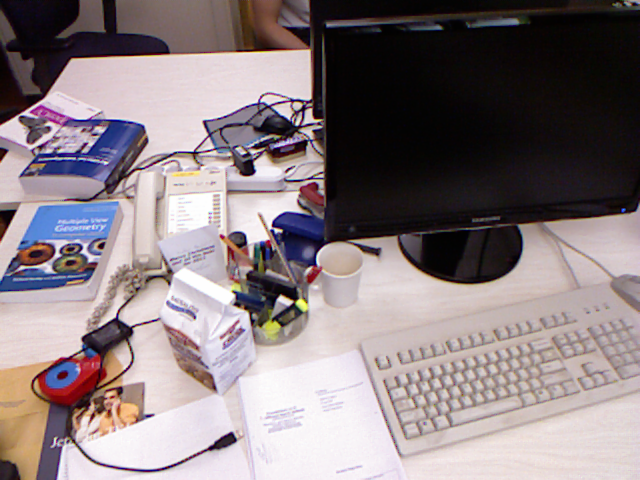

# Survey on monocular visual SLAM :eye_speech_bubble:
This repository includes the code of the experiments introduced in the paper:
> Álvarez-Tuñón, O., Brodskiy, Y., & Kayacan, E. (2023). Monocular visual simultaneous localization and mapping:(r) evolution from geometry to deep learning-based pipelines. *IEEE Transactions on Artificial Intelligence*.

Clone this repository with its submodules:

```bash
git clone --recurse-submodules -j8 git@github.com:olayasturias/monocular_visual_slam_survey.git
```
If you forgot to clone the submodules, you can download them afterwards as

```bash
git submodule update --init --recursive
```
## Index
- [1. Structure for this repo](#1-structure-for-this-repo)
- [2. Installation](#2-installation)
    - [2.1 DF-VO](#21-df-vo)
    - [2.2 TrianFlow](#22-trianflow)
    - [2.3 ORB-SLAM3](#23-orb-slam3)
    - [2.4 DSO](#24-dso)
- [3. Usage](#3-usage)
    - [3.1 Run DF-VO](#31-run-df-vo)
    - [3.2 Run TrianFlow](#32-run-trianflow)
    - [3.3 Run ORB-SLAM3](#33-run-orb-slam3)
    - [3.4 Run DSO](#34-run-dso)
    - [3.5 Run all at once](#35-run-all-at-once)
- [4. Supported datasets](#4-supported-datasets)


## 1. Structure for this repo
This repository contains a folder called `algorithms` with submodules pointing to the algorithms implemented in the experimental comparison for the survey.
The scripts under the `script` folder can be easily modified to automatically run each algorithm independently or all the algorithms at once. They automatically generate the necessary configs and store the results in the respective folders as shown below:

```
monocular_visual_slam
├── algorithms
│   └── <algorithm> # as a github submodule
├── configs
│   └── <algorithm>
│   │   ├── <dataset_i>
│   │   │   └── <track_name>.yml
│   │   └── <dataset_i+1>
│   │       └── <track_name>.yml
├── results
│   └── <algorithm>
│   │   ├── <dataset_i>
│   │   │   └── <track_name>
│   │   │   │   └── result.txt
│   │   └── <dataset_i+1>
│   │           └── result.txt
├── media
│   └── some_cool_slam_pic.png
├── scripts
│   └── run_<algorithm>.sh
│   └── run_all.sh
└── README.md
```
## 2. Installation
For those libraries using python, we will create the correspondent virtual environments to ensure that we have the correct versions for each.
Follow the given naming for the environments, or at least be aware that the scripts refer to the names used here. If you use different names, you'll need to modify the script `scripts/run_all.sh`
### 2.1 DF-VO
Create a conda environment for DF-VO as follows:

```bash
cd algorithms/DF-VO/envs
conda env create -f requirement.yml
```
Note that this could take a while 	:tea:
For DF-VO, the models are downloaded [here](https://www.dropbox.com/sh/9by21564eb0xloh/AABHFMlWd_ja14c5wU4R1KUua?dl=0)
and saved in the directory `algorithms/DF-VO/model_zoo`

### 2.2 TrianFlow
Create a conda environment for TrianFlow as follows:
```bash
cd algorithms/TrianFlow
conda env create -f requirement.yml
```

For TrianFlow, the models are downloaded [here](https://drive.google.com/drive/folders/1rPXlK9bJpjU0OQH5leDCvyb0FcL5jlUk)
and saved in the directory `algorithms/TrianFlow/models`

### 2.3 ORB-SLAM3
Install the requirements indicated in the README. Once you've done that, build ORB_SLAM3 as:
```bash
cd algorithms/ORB_SLAM3
./build.sh
```

Note: for Pangolin and Eigen I recommend you to follow the instructions [in this post](https://olayasturias.github.io/ros/slam/survey/2022/03/01/slam-surveying-install.html). Tested with Eigen3.4 and Pangolin v0.6.

### 2.4 DSO
Install the requirements indicated in [DSO's README](https://github.com/olayasturias/dso/blob/master/README.md). Once you've done that, build DSO as:
```bash
cd algorithms/dso
mkdir build
cd build
cmake ..
make -j16 # or whichever number of cores you have 
```
Note: for Pangolin and Eigen I recommend you to follow the instructions [in this post](https://olayasturias.github.io/ros/slam/survey/2022/03/01/slam-surveying-install.html). Tested with Eigen3.4 and Pangolin v0.6.

## 3. Usage
We provide scripts for running each of the algorithms independently and also all at once. For the python-based methods, the scripts use the conda environments following the naming from the Installation section. If you use different names, you'll need to modify the script `scripts/run_all.sh`

### 3.1 Run DF-VO
First of all, DF-VO requires config files that handle the data loading parameters for each dataset. Some of them are already originally provided by the repository. We aditionally provide scripts that automatically generate those configs for additional datasets like MIMIR and TUM-RGBD:
 ```bash
cd scripts/
./generate_dfvo_configs.sh <DatasetName> <DatasetRoot> <Tracks> <ModelZooDir>
# For example:
./generate_dfvo_configs.sh TUM $HOME/Datasets rgbd_dataset_freiburg1_xyz $HOME/dev/monocular_visual_slam_survey/algorithms/DF-VO/model_zoo
```
This will automatically generate a config file called `<Tracks>.yml` under `DFVO/<DatasetName>/`, e.g. `DFVO/TUM/rgbd_dataset_freiburg1_xyz.yml`

Then, you're ready to execute DF-VO in your favourite dataset as:
 ```bash
cd scripts/
./run_dfvo.sh <DatasetName> <DatasetRoot> <Tracks>
# For example:
./run_dfvo.sh TUM $HOME/Datasets rgbd_dataset_freiburg1_xyz
```

### 3.2 Run TrianFlow
Running Trianflow with any of the supported datasets is as simple as:
 ```bash
cd scripts/
./run_trianflow.sh <DatasetName> <DatasetRoot> <Tracks>
# For example:
./run_trianflow.sh TUM $HOME/Datasets rgbd_dataset_freiburg1_xyz
```

### 3.3 Run ORB-SLAM3
Running ORB-SLAM3 with any of the supported datasets is as simple as:
 ```bash
cd scripts/
./run_orb3_mono.sh <DatasetName> <DatasetRoot> <Tracks>
# For example:
./run_orb3_mono.sh TUM $HOME/Datasets rgbd_dataset_freiburg1_xyz
```


### 3.4 Run DSO
Running DSO with any of the supported datasets is as simple as:
 ```bash
cd scripts/
./dso.sh <DatasetName> <DatasetRoot> <Tracks>
# For example:
./dso.sh TUM $HOME/Datasets rgbd_dataset_freiburg1_xyz
```

### 3.5 Run all at once
Too busy to run those scripts and having to manually specify the input parameters? 
Well, you can run ALL **automatically** by just executing the script:
 ```bash
cd scripts/
./run_all.sh
```
This script considers that the folder where you have all the supported datasets is  `$HOME/Datasets`. If you have them in a different folder, you just need to modify the path that the variable `$datasetRoot` is pointing at. You also need to specify the tracks available for each dataset in the variables `<DatasetName>_tracks`.

# 4. Supported datasets
The datasets that can be used to run these algorithms off-the-shelf are:

| Dataset | Publication | Sample |
:-------------------------:|:-------------------------|:-------------------------:
[KITTI](https://www.cvlibs.net/datasets/kitti/eval_odometry.php) | Geiger, A., Lenz, P., Stiller, C., & Urtasun, R. (2013). Vision meets robotics: The kitti dataset. *The International Journal of Robotics Research, 32(11), 1231-1237.* |  |
[EuRoC](https://projects.asl.ethz.ch/datasets/doku.php?id=kmavvisualinertialdatasets) | Burri, M., Nikolic, J., Gohl, P., Schneider, T., Rehder, J., Omari, S., ... & Siegwart, R. (2016). The EuRoC micro aerial vehicle datasets. *The International Journal of Robotics Research, 35(10), 1157-1163.* | |
[Aqualoc](https://www.lirmm.fr/aqualoc/) | Ferrera, M., Creuze, V., Moras, J., & Trouvé-Peloux, P. (2019). AQUALOC: An underwater dataset for visual–inertial–pressure localization. *The International Journal of Robotics Research, 38(14), 1549-1559.* | |
[TUM-RGBD](https://cvg.cit.tum.de/data/datasets/rgbd-dataset) | Sturm, J., Engelhard, N., Endres, F., Burgard, W., & Cremers, D. (2012). RGB-D SLAM dataset and benchmark. *Computer Vision Group TUM Department of Informatics Technical University of Munich.*| |
[MIMIR](https://github.com/remaro-network/MIMIR-UW) |  O. Álvarez-Tuñón et al., “MIMIR-UW: A multipurpose synthetic dataset for underwater navigation and inspection,” *2023 IEEE/RSJ International Conference on Intelligent Robots and Systems (IROS).*| |